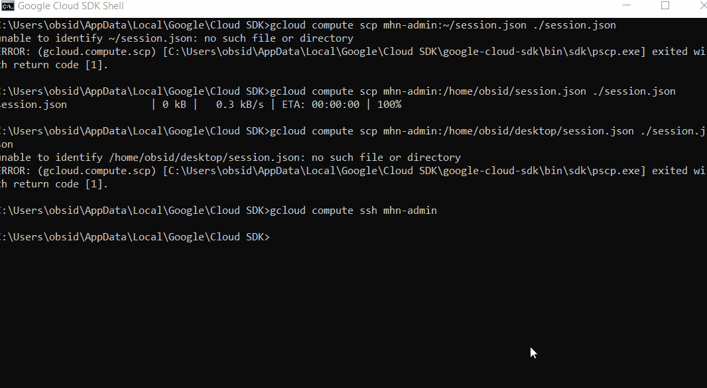

# Honeypot Assignment

**Time spent:** **8** hours spent in total

**Objective:** Create a honeynet using MHN-Admin. Present your findings as if you were requested to give a brief report of the current state of Internet security. Assume that your audience is a current employer who is questioning why the company should allocate anymore resources to the IT security team.

### MHN-Admin Deployment (Required)

**Summary:** How did you deploy it? I used GCP to deploy the mhn-admin below and using the guide provided by codepath to build the firewall rules, making sure to replace every '/' with '^'. It's important to have your google account and billing information in order or the GCP will not let you procede with these changes to the firewall. Follow codepath's guide to create the mhn-admin vm and then establish ssh access to the vm via: gcloud compute ssh mhn-admin.

### Dionaea Honeypot Deployment (Required)

**Summary:** Briefly in your own words, what does dionaea do? Dionaea is supposed to be a nepenthes successor, it embedds python scripting language and uses libemu to detect shellcodes. Created Dionaea ina similar way to the mhn-admin vm, except we need to deploy an ubuntu/raspberry-pi-dionaea script to install the software. Then we can see that our new honeypot is listed under sensors.

### Database Backup (Required) 

**Summary:** What is the RDBMS that MHN-Admin uses? The rdbms that it uses is mnemosyne. What information does the exported JSON file record? It records the attacks that our honeypots have intercepted while in operation. Exporting the JSON file was easy but finding where it was, was another task in itself, but eventually it was found.
See session.json file attached.
*Be sure to upload session.json directly to this GitHub repo/branch in order to get full credit.*

### Deploying Additional Honeypot(s) (Optional)

#### 2 Honeypots

**Summary:** What does this honeypot simulate and do for a security researcher? These honeypots simulate being attacked by attackers all over the gobe so we can intercept their attacks and gain an understanding of what hackers are doing now and how we can prevent against them. I created two additional honeypots. 

