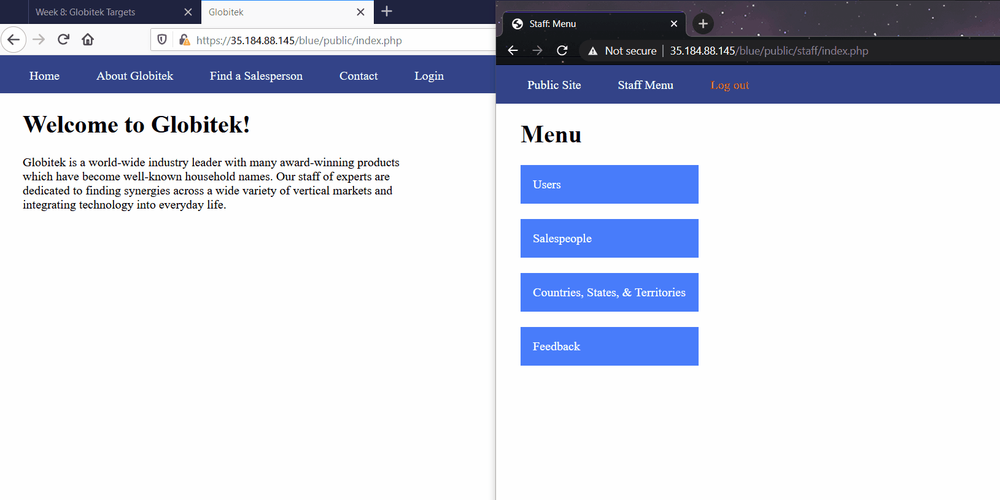

# Project 8 - Pentesting Live Targets

Time spent: **10** hours spent in total

> Objective: Identify vulnerabilities in three different versions of the Globitek website: blue, green, and red.

The six possible exploits are:

* Username Enumeration
* Insecure Direct Object Reference (IDOR)
* SQL Injection (SQLi)
* Cross-Site Scripting (XSS)
* Cross-Site Request Forgery (CSRF)
* Session Hijacking/Fixation

Each color is vulnerable to only 2 of the 6 possible exploits. First discover which color has the specific vulnerability, then write a short description of how to exploit it, and finally demonstrate it using screenshots compiled into a GIF.

## Blue

Vulnerability #1: SQL Injection

Description: We insert the following sql command into the url: %27%20OR%20SLEEP(5)=0--%27
Now we can see that this command makes the database wait a couple of seconds to query the data.

Vulnerability #2: Session Hijacking/Fixation

Description: We grab the victim's session ID with the codepath tool provided: hacktools/change_session_id.php. Using burp, we can intercept the attackers side in an attempt to secure the site. We can modify the attackers session ID with the one of the victims and once its been forwarded the attacker is now logged in as the victim.

## Green

Vulnerability #1: Username Enumeration

Description: Here we use the example name, jmonroe99, where the failure to login message differs for the Username that exists vs doesn't exist. Using the element tool in firefox wecan see that the developer uses "Failed" and "Failure" on the error message depending on the exact senario, "Failure" is given in bold while the other isn't.

Vulnerability #2: __________________

Description:

## Red

Vulnerability #1: __________________

Description:

Vulnerability #2: __________________

Description:

## Notes

Describe any challenges encountered while doing the work
